#Assemble the power meter

To assemble the power meter you will need to attach blades to each shaft section. It is **very important** that the blades are aligned with the zero angle on the shaft as detailed in Step 4 below.

The following steps will guide you through the assembly process.

---

### Step 1

* Identify the left shaft section \(it is the shaft section with the length scale and it is the shortest of the two\).

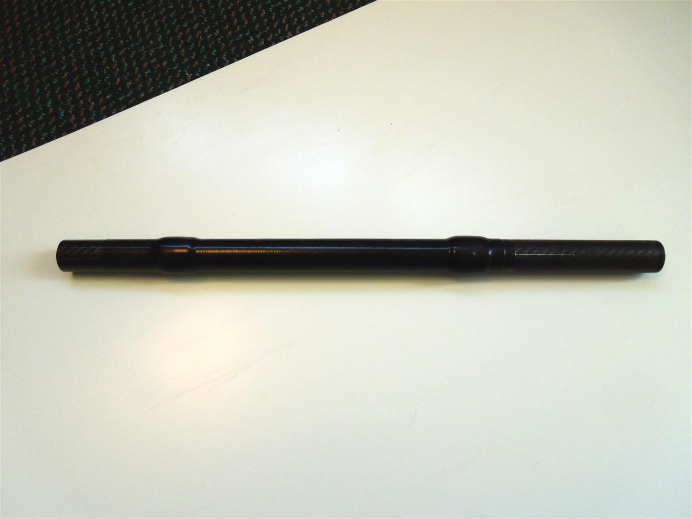

* Identify the right shaft section \(it is the shaft section with the connection clamp and it is the longest of the two\).

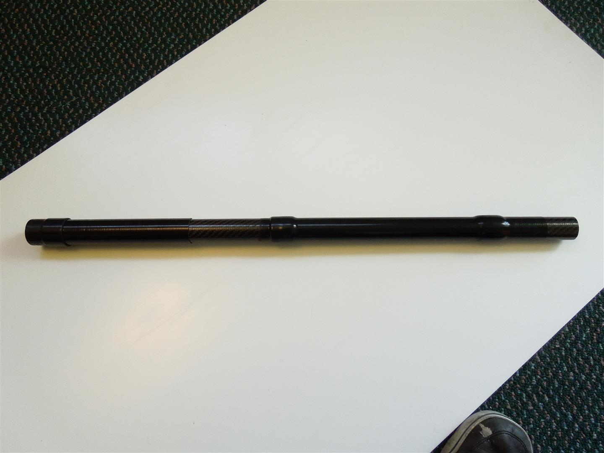

* Assemble the paddle \(without applying glue\) to check that the blades fit the shaft.

---

### Step 2

* Apply a few layers of tape over the heat shrink to prevent overheating and melting of the heat shrink.

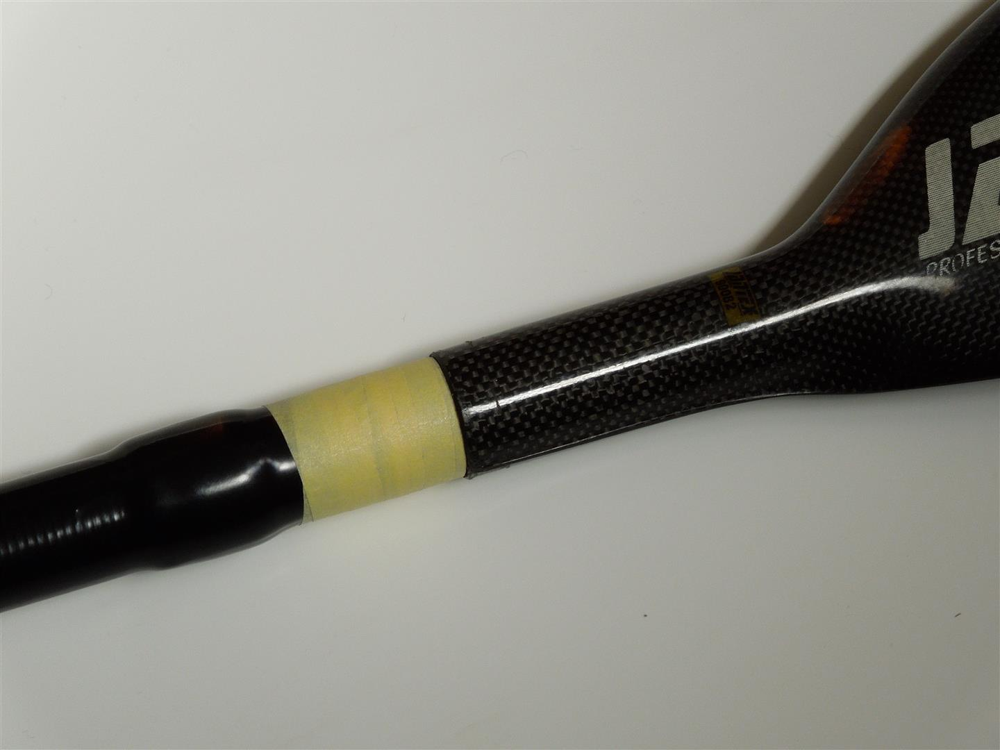

* Apply tape to the blade at its throat.

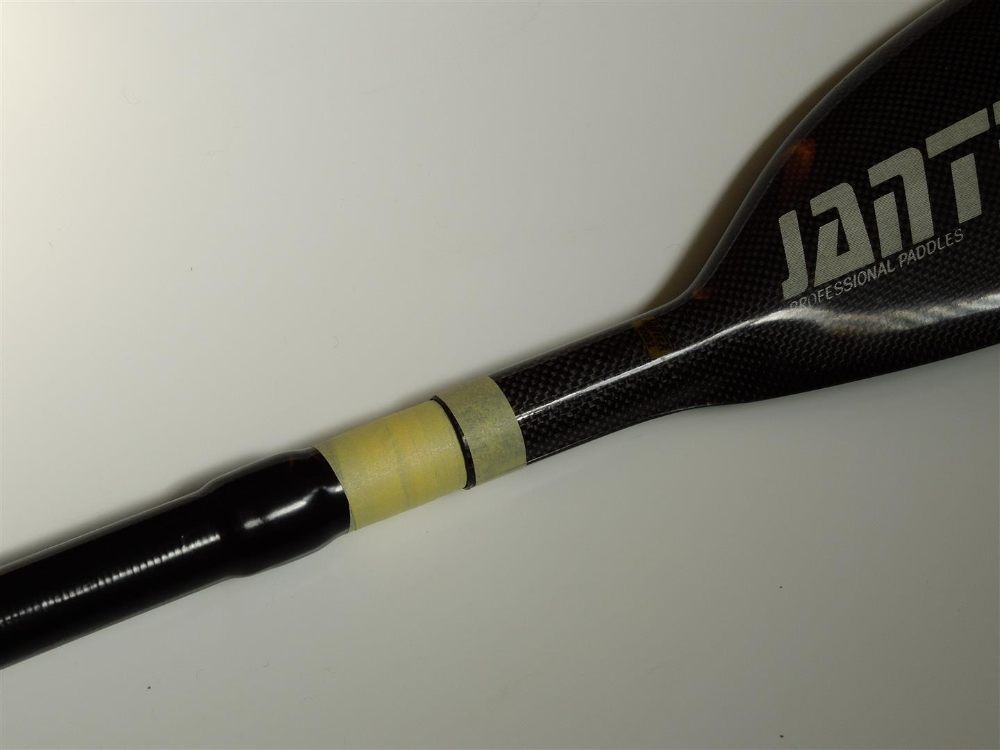

---

### Step 3

* Assemble the left and right shafts and set the offset angle to zero.

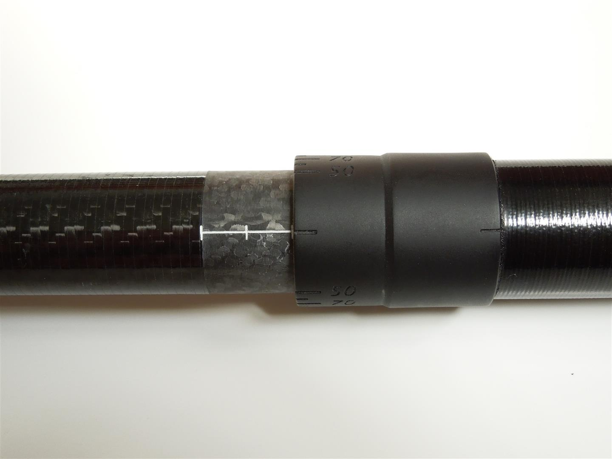

---

### Step 4

* Align the left blade so that the face of the blade is aligned with the zero angle.

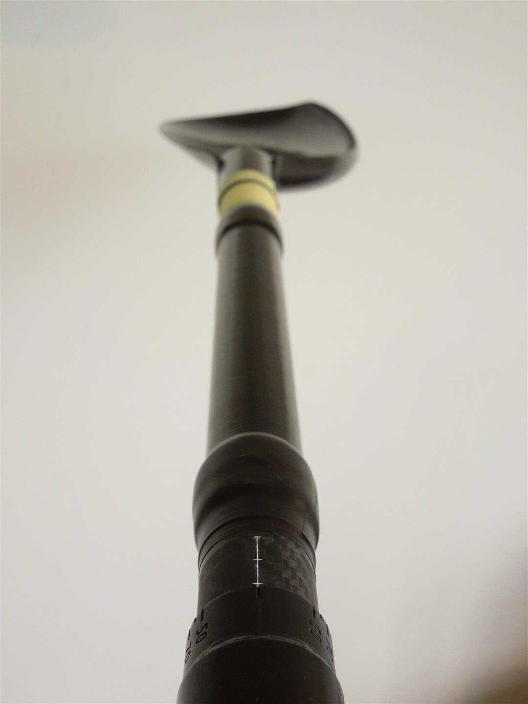

---

### Step 5

* Using a pen, mark this alignment on the tape applied in Step 2.

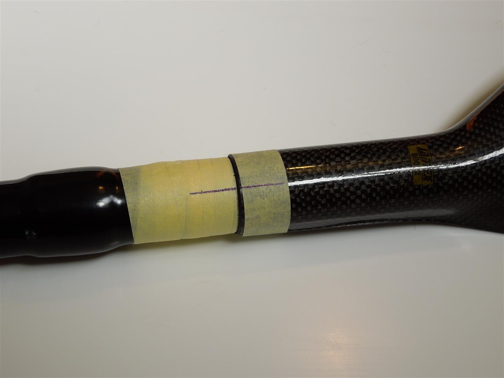

---

### Step 6
* Rotate the right blade so that it is aligned with the left blade.
* Take care ensure that the alignment marks scribed on the left blade remain aligned.
* This step can be done using an assembly jig. If you don’t have access to an assembly jig – you can either use a spirit level (go to Step 7) or two level surfaces (go straight to Step 8.

---

### Step 7
* Place a level across the left blade a measured distance from the tip of the blade.
* Rotate the shaft and blade together until the blade is level.
* Clamp/secure the shaft so that it doesn't move.

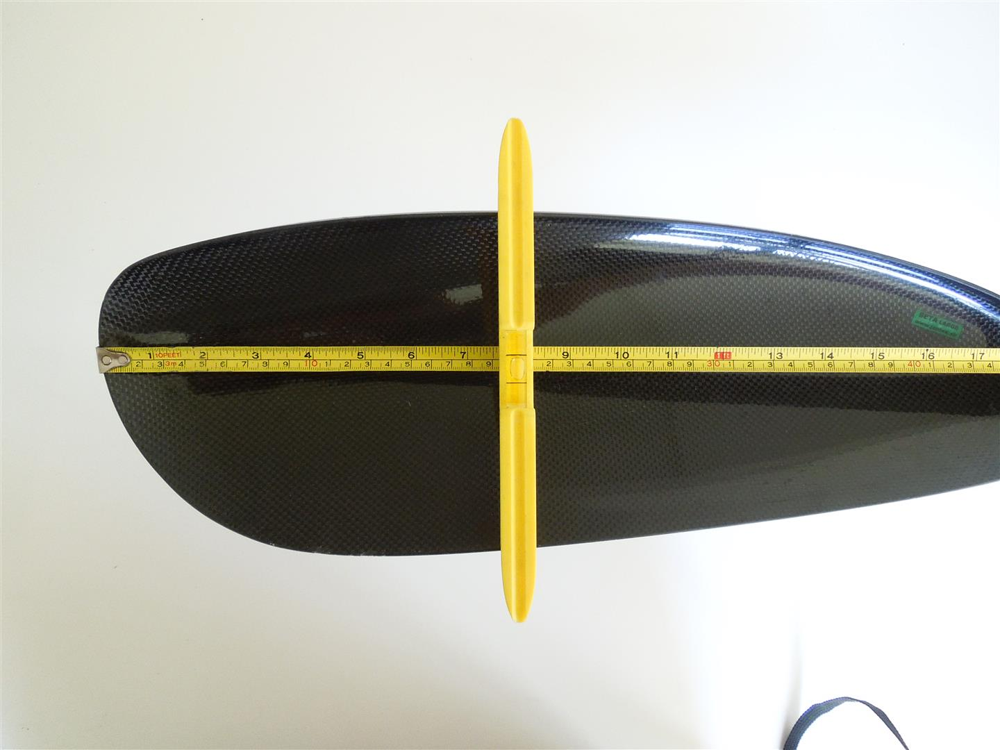

* Place the level onto the right blade, the same measured distance from the tip.
* Rotate the blade until it is level.
* Using a pen, mark this position by scribing alignment marks (see Step 5).

---

### Step 8
* Set up two level surfaces (e.g. chairs or pieces of wood on concrete).
* Space the surfaces so that the blades rest on the surface an equal distance from each tip.
* Rotate the right blade so that both left and right blades lay flush onto the bearing surface.
* Using a pen, mark the position of the right blade by scribing alignment marks (see Step 5).

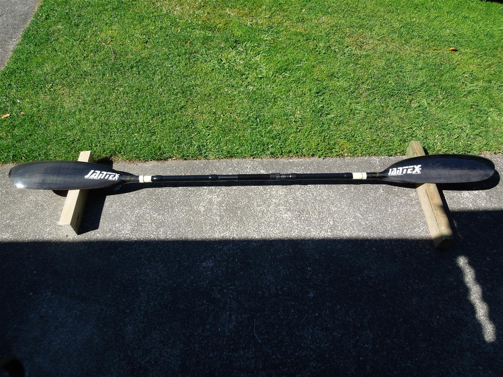

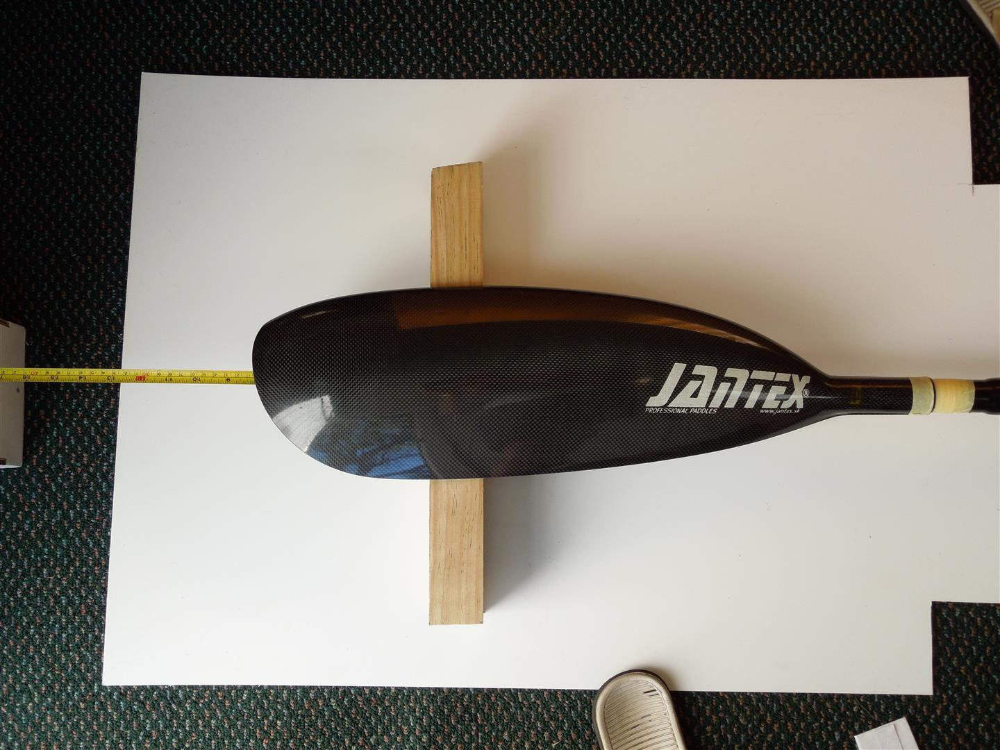

---

### Step 9
* Remove the blades and prepare for gluing. Use the scribed marks to position the blades when gluing the blades on.
* Ensure that the surfaces are clean and free of dust and wax/grease. It is recommended that the surfaces are sanded with medium grade sand paper to aid the adhesion of the hot melt glue.

---

### Step 10
* Apply glue to the shaft. If you don’t have a hot melt glue application gun, heat up the glue stick with a heat gun then apply the melted stick to the shaft.

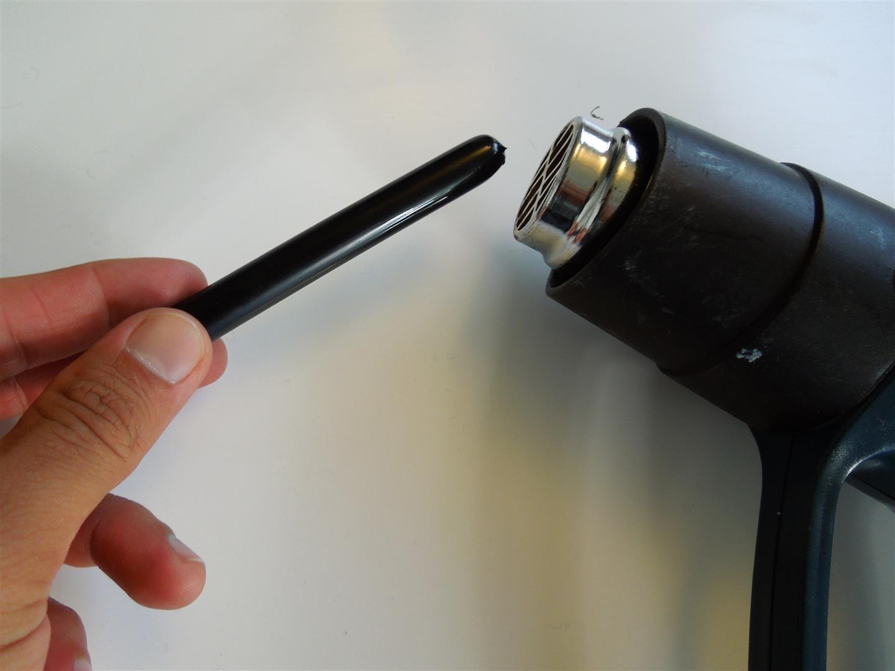

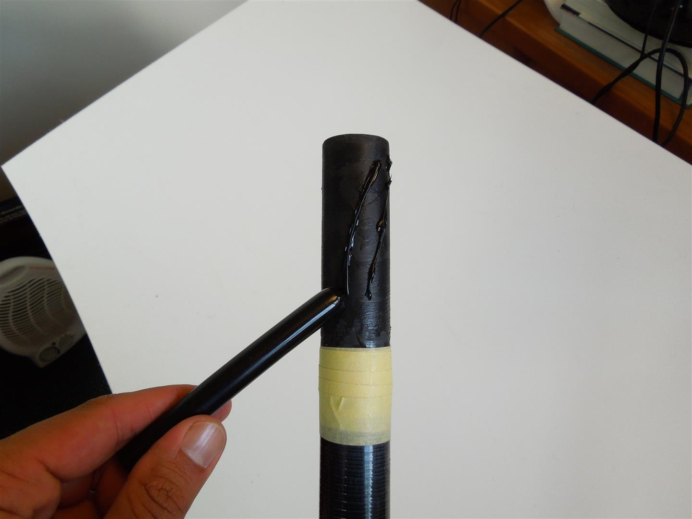

---

### Step 11
* Apply a gentle heat to the blade and the shaft to prolong the workable time of the hot melt glue.
* Take care not to overheat the blade or shaft.

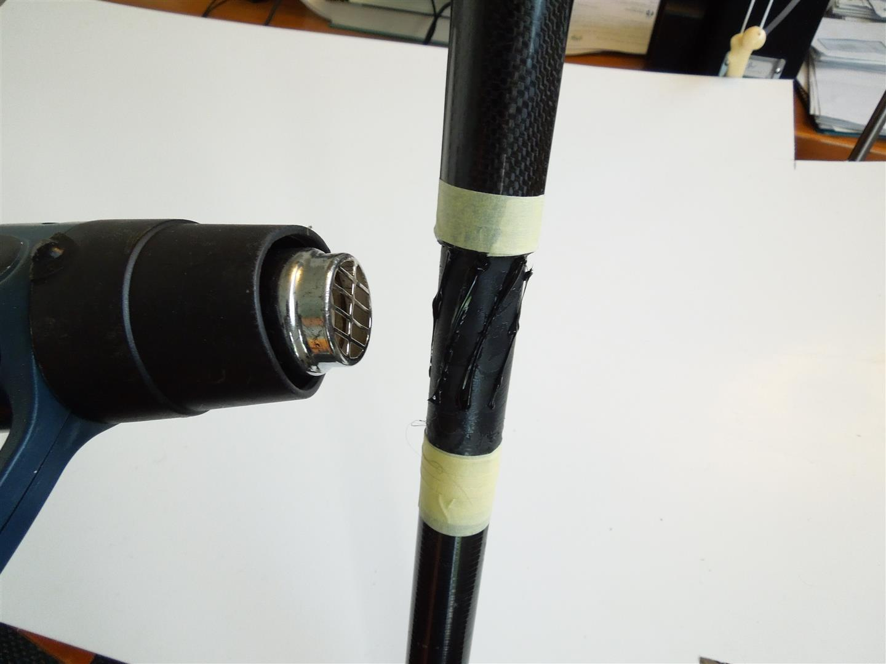

---

### Step 12
* Whilst the glue is in a hot and workable condition, twist on the blade so that the markings align.
* Make sure that the glue is hot when doing this. If the glue begins to set before the blade can be located, gently heat up the shaft and blade until the glue melts again.

---

### Step 13
* Wipe off the excess glue. It is recommended that some of the excess glue be left on the paddle to prevent water entering the join connection.
* Leave the glue to set for 5 – 10 minutes. Check that the alignment marks are still aligned before removing the tape.