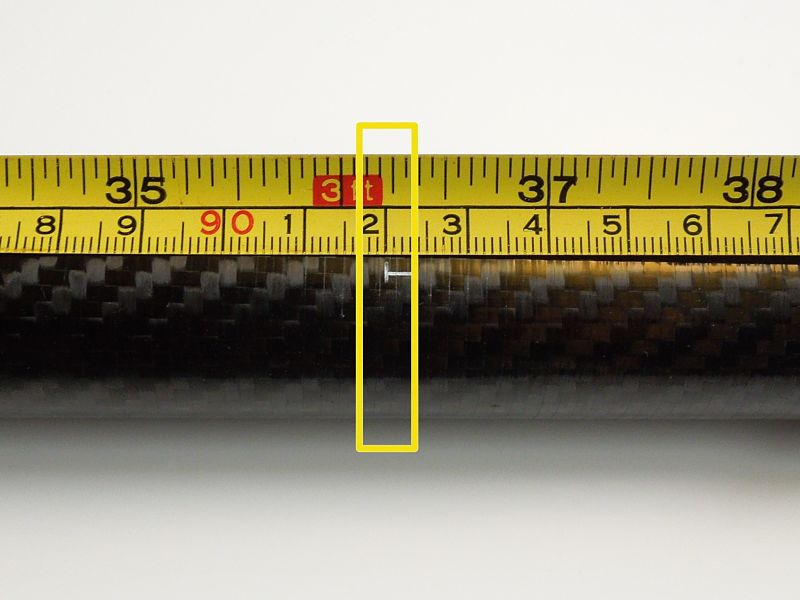
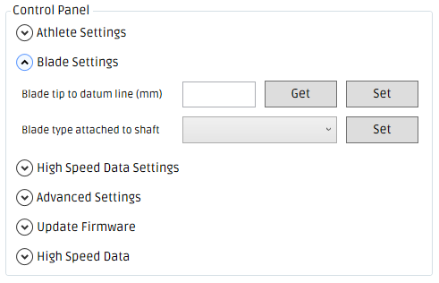
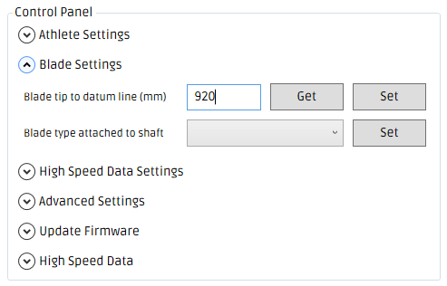
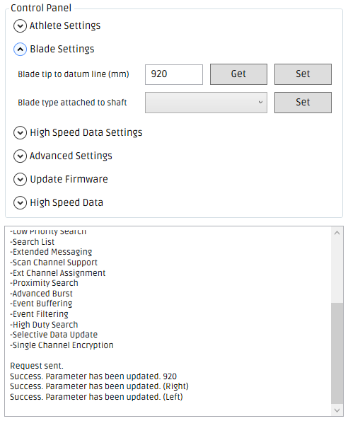

#Blade tip to datum line distance

>the distance between the blade tip and the datum line mark on the shaft.

---

### Step 1
* Attach the tape measure to the tip of the left blade.

* Measure the distance from the left blade tip to the engraved mark on the left shaft section. This mark is known as the 'left datum line'.
* In the example image the measurement is 920 mm.

---

### Step 2
* Attach the end of the tape measure to the tip of the right blade.
* Measure to the distance from the right blade tip to the engraved mark on the right shaft section. This mark is known as the 'right datum line'.
* In the example image the measurement is 920 mm.

---

### Step 3
* The distance from the left blade tip to the left datum line should be equal to the distance from the right blade tip to the right datum line, If you find that they differ, you will need to reposition one of the blades on the shaft so that the measurements match.
* This distance is known as 'Blade tip to datum line distance'.

---

### Step 4
* Open the One Giant Leap Windows Desktop App
* Connect to the desired power meter
* Expand the 'Blade Settings' tab
* To set the 'Blade tip to datum line distance' both the left and right shaft sections need to be connected.
* The 'Set' button will be enabled only when both shaft sections are connected.
* If the 'Set' button is disabled (as shown in the below image), gently shake both shaft sections and wait 10 - 15 seconds to give them time to reconnect.

---

### Step 5
* Enter the 'Blade tip to datum line distance' into the 'Blade tip to datum line distance (mm)' field in millimetres e.g. 920

* Click the 'Set' button.
* If the 'Blade tip to datum line distance' was successfully set, you should see _'Success. Parameter has been updated (Left)' & 'Success. Parameter has been updated (Right)'_

