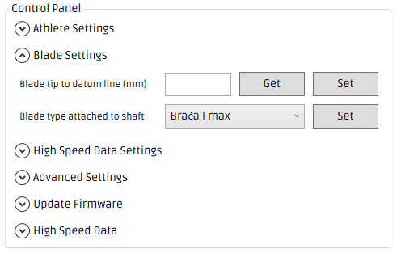
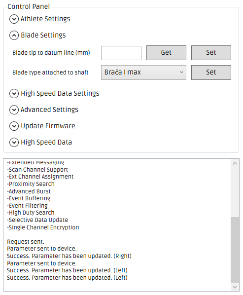

#Blade type attached to shaft

>the make and model of the blades you have attached to the shaft e.g. Jantex Beta Large.

---

### Step 1
* To set the 'Blade type attached to shaft' both the left and right shaft sections need to be connected.
* Select the appropriate blade type from the drop-down box directly to the right of 'Blade type attached to shaft'.

* Click the 'Set' button
* If the 'Blade type attached to shaft' was successfully set, you should see _'Success. Parameter has been updated (Left)'_ & _'Success. Parameter has been updated (Right)'._

