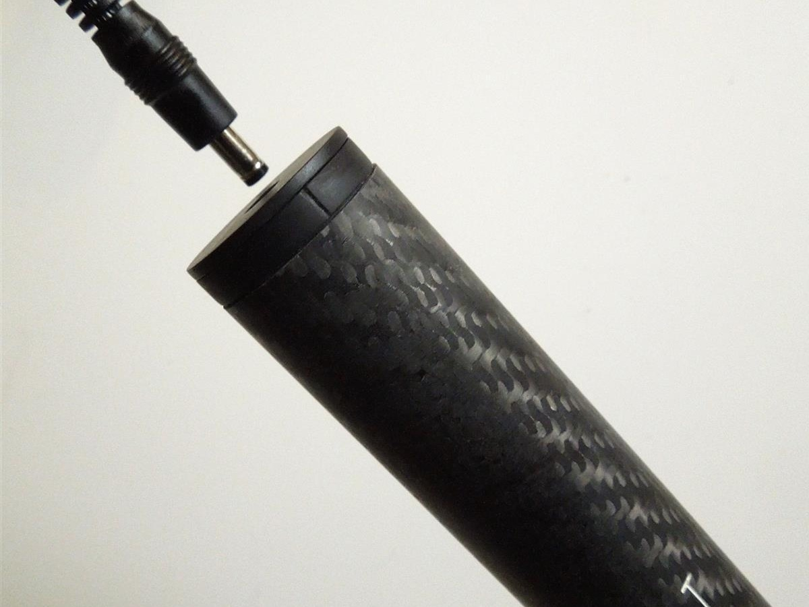
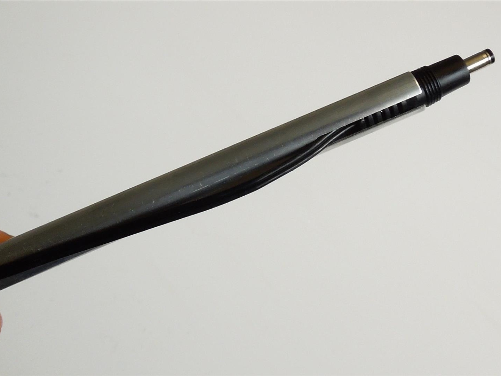
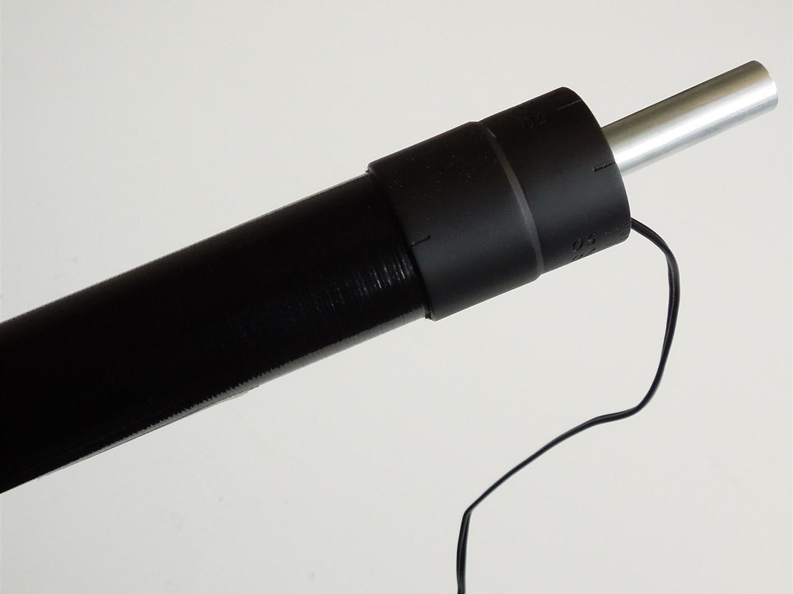

#Charge the power meter batteries

Each shaft section of the power meter contains a rechargable lithium-polymer battery. On a single charge, the battery will provide enough energy to power the power meter for 12 hours of paddling.

The power meter will automatically enter a 'deep sleep' mode when it senses no movement _or_ a 'low power' mode when it senses movement, but no force is being applied.

You may need to charge the batteries before you can start using the power meter. The following instructions will guide you through this process.

---

You will need to locate the two charging cables, the aluminium extender (shown below) and a 5V charging source (USB or 5V wall adaptor) to charge the batteries.

### Left shaft

* Charge the left shaft section by inserting the charging cable into the charging port located at the end of the shaft and the USB connector into a computer (or USB charger).

---

### Right shaft

* Insert the charging cable into the aluminium extender.

* The extender will allow the charging cable to be inserted into the charging port located inside the end of the right shaft section.

---

The easiest way to determine the battery level of each shaft section is to use the Windows Desktop App. When both shaft sections are connected, the status of each battery will be displayed (as shown below) on the right-hand side of the Windows Desktop App.

The status of each battery will be represented using one of the following descriptions:
* New
* Good
* OK
* Low
* Critical

Typically, the GPS watch will alert you (with a notification on the screen lasting 5 seconds) when the battery status of either shaft section becomes 'Low'.