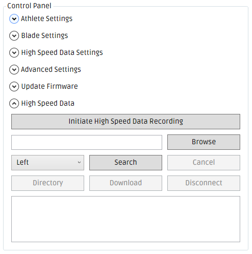
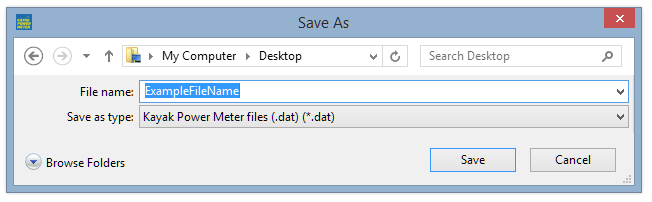
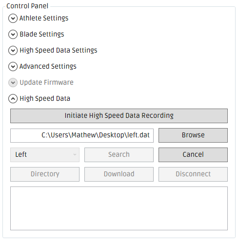
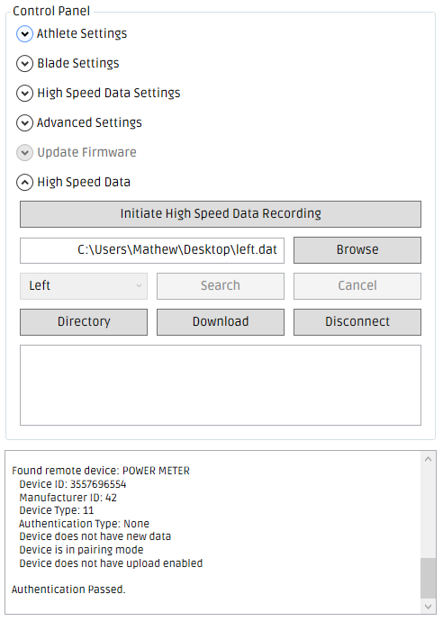
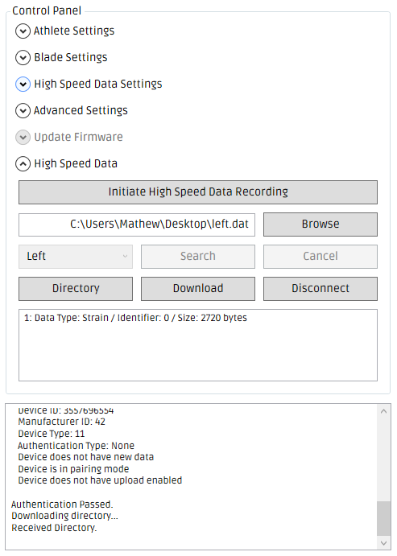
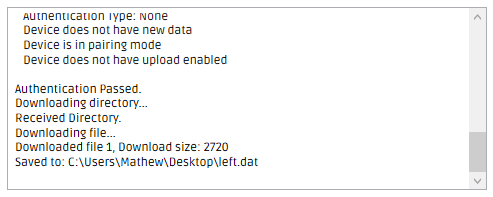
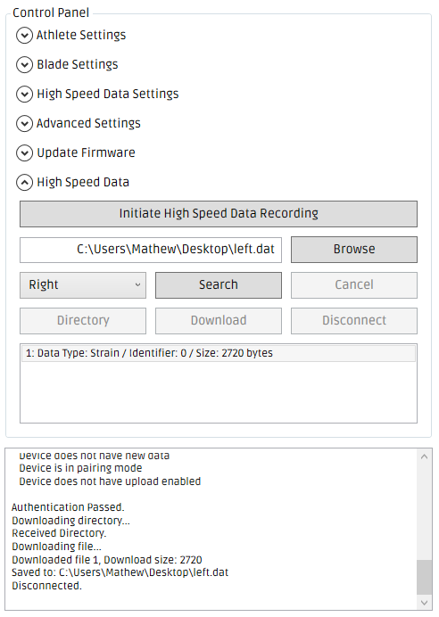

#How to download High Speed Data

When a High Speed Data file is recorded, the data pertaining to the _left stroke_ is stored on the **left** shaft section and the data pertaining to the _right stroke_ is stored on the **right** shaft section.

To retrieve the complete data set for a High Speed Data recording, you need to download one file from the **left** shaft section in addition to the corresponding file from the **right** shaft section. It does irrelevant which order you download the files.

The following steps you guide you through the process of connecting to the file system of each shaft section and downloading the High Speed Data files. 

---

### Step 1
* Open the Windows Desktop App
* Connect to the desired power meter
* Expand the 'High Speed Data' tab as shown below

---

### Step 2
* Click the 'Browse' button. The 'Save As' dialog box should appear (see below)
* Browse to the folder where you wish to download the data
* Enter the filename you wish to save the data as into the 'File name' input box

* Click the 'Save' button

---

### Step 3
* Set the drop-down box to either _Left_ or _Right_ depending on which shaft section you wish to download data from 
* Click the 'Search' button
* The Windows Desktop App will start searching for the shaft section you have selected

---

### Step 4
* When the shaft section is discovered and connected, the _Directory_, _Download_ and _Disconnect_ buttons will become enabled

---

### Step 5
* Click _Directory_ to download the list of files that are currently stored on the internal memory of the shaft section
* A summary of each file will be displayed in the box at the bottom of the 'High Speed Data' tab
In the example image below, only one file is currently stored on the file system

---

### Step 6
* Click on the file you wish to download
* The file will become highlighted - this file is now selected - only one file can be selected at a time
* Click the Download button to download the currently selected file - it will be saved as the filename which is entered in the 'File name' box
* If no file is selected when the _Download_ button is clicked, the file at Index 1 will be downloaded (if it exists)

* If the file is successfully downloaded, 'Downloaded file...' should be displayed (see above)

---

### Step 7
* Once you have downloaded the data you require, click _Disconnect_
* You can now select the other shaft section (e.g. Right) from the drop-down box and repeat steps 3 - 6 to download the data from that shaft section

