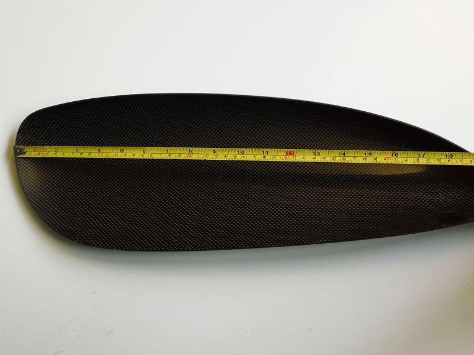
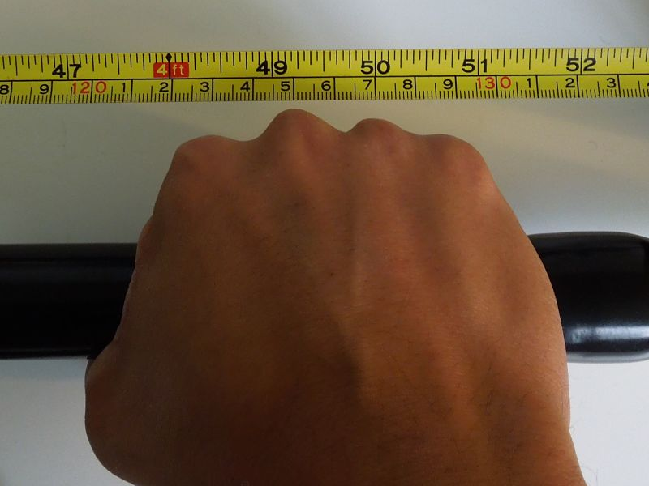
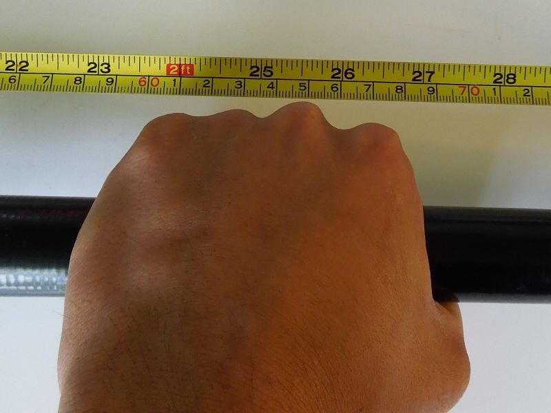
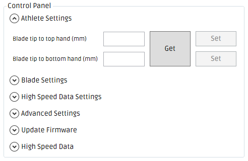

# Measure the 'Athlete Specific' settings

The 'Athlete Specific' settings need to be set initially and updated _whenever_ you:

* change the location of your hands along the shaft
* change your overall paddle length*
* attach a new set of blades to the power meter*

*due to the fact that you may inadvertently change the location of your hands with respect to the blade tip in this scenario

---

There are two 'Athlete Specific' settings to measure and input:

1. _Blade tip to top hand distance (e.g. 1250mm)_
> the distance between the blade tip and the pushing hand (the hand furthest away from the blade in the water during a stroke).
2. _Blade tip to bottom hand distance (e.g. 650mm)_
> the distance between the blade tip and the pulling hand (the hand closest to the blade in the water during a stroke).

---

Note: **Blade tip to top hand** *will always be a larger number* than **Blade tip to bottom hand**.

Note: Applying tape over the shaft in the location of the measured hand positions (as shown below) can help ensure that the athlete's hand positions do not change during paddling.

The following steps will guide you through the process of measuring the distances and updating these settings on the power meter using the Windows Desktop App.

---

### Step 1
* Attach the end of the measuring tape to the tip of the left (or right) blade.
* All measurements must be made from the same blade tip.

> Note: When measuring the two distances outlined in Step 2 & Step 3 below, please ensure that the measured distance is the **same** regardless of whether it was measured from the **left** *or* the **right** blade tip. This will be the case if the athlete is holding the paddle symmetrically.

---

### Step 2
* Determine the position of the top hand (the hand farthest from the blade in the water) by measuring to the knuckle of your middle finger.
* This value is the 'Blade tip to top hand distance'.
* The 'Blade tip to top hand distance' is 1250 mm in the example image below.

---

### Step 3
* Determine the position of the bottom hand (the hand closest to the blade in the water) by measuring to the knuckle of your middle finger.
* This value is the 'Blade tip to bottom hand distance'.
* The 'Blade tip to bottom hand distance' is 650 mm in the example image below.

---

### Step 4
* Open the One Giant Leap Windows Desktop App.
* Connect to the desired Kayak Power Meter.
* Expand the 'Athlete Settings' tab.

> To set the 'Blade tip to top hand distance' & the 'Blade tip to bottom hand distance' both the left and right shaft sections need to be connected.

>The 'Set' buttons will be enabled only when both shaft sections are connected. If the 'Set' buttons are disabled (as shown in the below image), gently shake both shaft sections and wait 10 - 15 seconds to give them time to reconnect.

---

### Step 5
* Enter the 'Blade tip to top hand distance' into the 'Blade tip to top hand distance (mm) field in millimetres e.g. 1250
* Click the 'Set' button.
* If the 'Blade tip to top hand distance' was successfully set, you should see 'Success. Parameter has been updated (Left)' & 'Success. Parameter has been updated (Right)'.

---

### Step 6
* Enter the 'Blade tip to bottom hand distance' into the 'Blade tip to bottom hand distance (mm)' field in millimetres e.g. 650
* Click the 'Set' button.
* If the 'Blade tip to bottom hand distance' was successfully set, you should see 'Success. Parameter has been updated (Left)' & 'Success. Parameter has been updated (Right)'.

