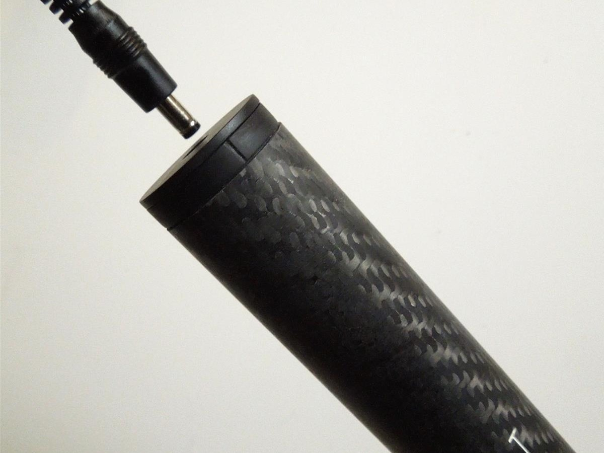
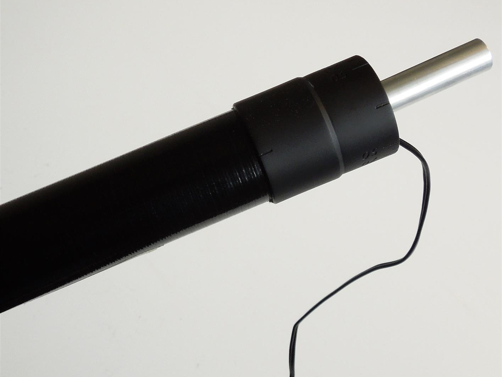

#Updating the Firmware

The Windows Desktop App will notify you when an update to the power meter firmware is available.

The left and the right shaft section _must_ be running identical versions of firmware for the power meter to operate succesfully.

>Note: There will be a short period of time when the shaft sections are running different versions of firmware during the updating process outlined below - this is expected and permitted.

The following steps will guide you through the process of updating the firmware on an individual shaft section. You will need to complete the process twice - once for the left shaft section and once for the right shaft section.

##Step 1

* Open the Windows Desktop App
* Expand the 'Update Firmware' tab.

---

##Step 2

* Ensure the USB connector end of the charging cable is plugged into a 5V charging source (USB port or 5V wall adaptor).

* Click the _'Search'_ button in the 'Update Firmware' section, then shortly after, insert a charging cable into the **specific shaft section** you wish to update. Please ensure that no charging cable is inserted into _any other shaft section nearby_ during this procedure. 

> Note: Upon inserting the charging cable, the shaft section will be 'discoverable' for the next 10 seconds. If the shaft section is not 'discovered' by the Windows Desktop App in that time (i.e. the 'Update' button does not become enabled), please re-insert the cable.

### Left shaft

###Right shaft

---

## Step 3

* When the shaft section has been 'discovered', the _'Update'_ and _'Disconnect'_ buttons are enabled and the 'Found remote device: BOOTLOADER' is printed in the console as shown below.

* Click _'Update'_. The Windows Desktop App will proceed to upload the firmware.

* Once uploaded, the firmware will be automatically programmed (which takes approximately 20 seconds). Do not unplug the shaft during this time.

* When the firmware has been successfully programmed, the device will disconnect from the Windows Desktop App. You will know this has taken place because the _'Search'_ button is enabled and _'Disconnected.'_ is printed in the console as shown below. 

---

The firmware has now been updated on the shaft section in question. If you have not already done so, you will need to repeat Steps 2-3 to update the firmware on the remaining shaft section.
